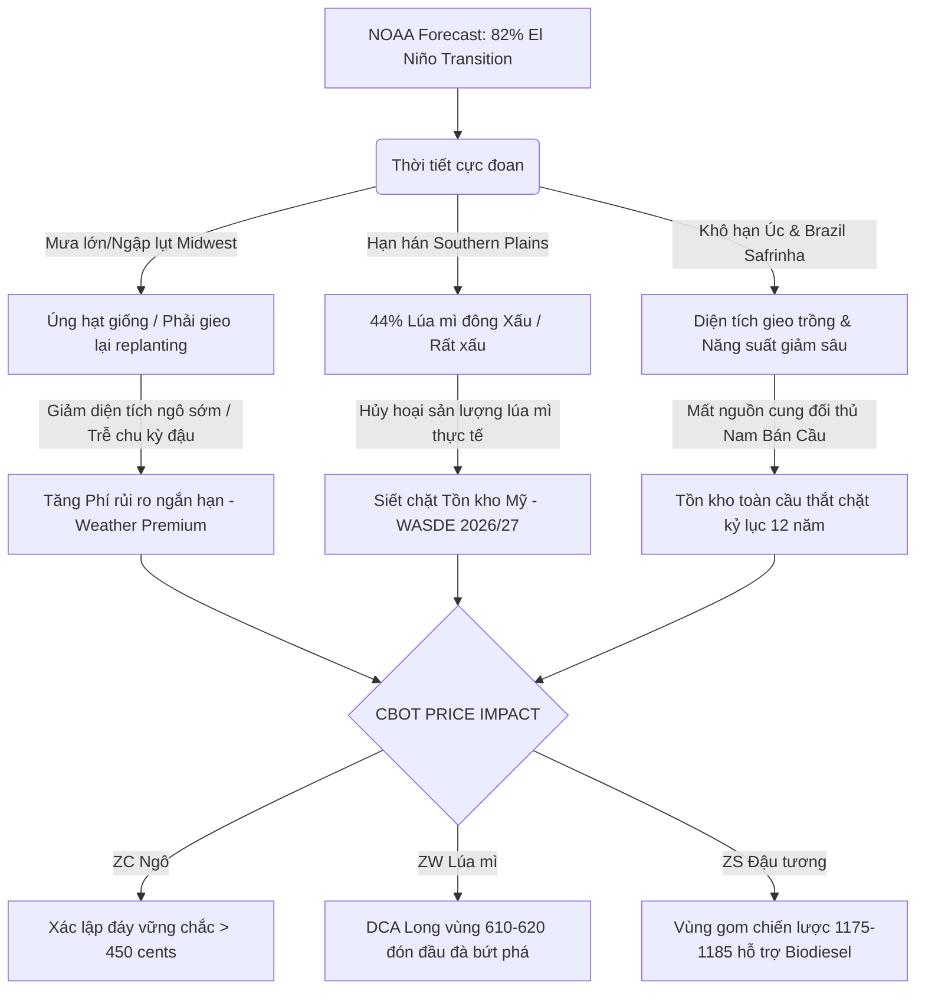

# 🌾 BÁO CÁO PHÂN TÍCH CHUYÊN SÂU: TIẾN ĐỘ MÙA VỤ MỸ, THỜI TIẾT NOAA & CẬP NHẬT CUNG - CẦU USDA
*Tập trung phân tích Phí bảo hiểm rủi ro thời tiết (Weather Risk Premium) & Các yếu tố chu kỳ nông nghiệp (Cập nhật ngày 30/05/2026)*

---

## 🌐 TỔNG QUAN TÌNH HÌNH VĨ MÔ & NÔNG NGHIỆP TOÀN CẦU
> [!IMPORTANT]
> **Điểm nhấn vĩ mô & rủi ro thời tiết cuối tháng 5/2026:**
> 1. **Khủng hoảng chất lượng Lúa mì đông:** Chỉ có **26%** lúa mì đông của Mỹ đạt chất lượng Tốt/Xuất sắc (Good/Excellent), trong khi tỷ lệ Xấu/Rất xấu leo thang lên **44%** do hạn hán nghiêm trọng kéo dài tại Southern Plains. Đây là nhân tố chính giữ cho phí bảo hiểm thời tiết của Lúa mì (ZW) duy trì ở mức cao kỷ lục.
> 2. **Sự dịch chuyển El Niño (Xác suất 82%):** Quá trình chuyển pha nhanh chóng sang El Niño từ tháng 5-7/2026 đang gây ra tình trạng thời tiết cực đoan kép: ngập úng tại Đông Midwest (gieo trồng lại Đậu tương ZS) và khô hạn cục bộ tại rìa phía Bắc (Minnesota, Northern Plains) đe dọa nảy mầm Ngô ZC.
> 3. **Tồn kho toàn cầu thắt chặt:** Báo cáo USDA tháng 5/2026 xác nhận tồn kho ngô niên vụ mới 2026/27 giảm mạnh 8.63% xuống còn 1.957 triệu bushels do diện tích giảm, trong khi tồn kho ngô thế giới chạm mức thấp nhất 12 năm.

---

## 📊 BẢNG 1: TIẾN ĐỘ GIEO TRỒNG & TÌNH TRẠNG MÙA VỤ MỸ (Cập nhật tuần kết thúc 24/05/2026)
*So sánh trực tiếp với tuần trước (17/05/2026), cùng kỳ năm 2025 và trung bình 5 năm.*

| Cây trồng & Chỉ tiêu mùa vụ | Tuần này (24/05/2026) | Tuần trước (17/05/2026) | Tiến độ trong tuần | Cùng kỳ 2025 | Trung bình 5 năm | So với TB 5 năm | Đánh giá Tác động & Phí rủi ro (Premium) |
| :--- | :---: | :---: | :---: | :---: | :---: | :---: | :--- |
| 🌽 **Ngô - Gieo trồng (Corn Planted)** | **86%** | 76% | 📈 **+10%** | 86% | 83% | 🟢 **+3%** | **Neutral:** Tiến độ gieo trồng đạt mức thuận lợi và nhanh hơn trung bình 5 năm nhờ thời tiết khô ráo ở phía Tây. Giới đầu cơ giảm nhẹ phí rủi ro gieo trồng ngắn hạn. |
| 🌽 **Ngô - Nảy mầm (Corn Emerged)** | **60%** | 39% | 📈 **+21%** | 65% | 58% | 🟢 **+2%** | **Bullish/Neutral:** Mặc dù nhanh hơn TB 5 năm nhưng đang chậm hơn 5% so với năm ngoái do thời tiết lạnh và ngập úng cục bộ ở phía Đông Corn Belt (Indiana, Ohio). |
| 🌱 **Đậu tương - Gieo trồng (Soybeans Planted)** | **79%** | 67% | 📈 **+12%** | 75% | 68% | 🟢 **+11%** | **Neutral/Bearish:** Tiến độ gieo trồng thần tốc vượt xa trung bình 5 năm tới 11%. Nông dân tranh thủ những ngày tạnh ráo để đẩy nhanh tiến độ trước hạn bảo hiểm cây trồng. |
| 🌱 **Đậu tương - Nảy mầm (Soybeans Emerged)** | **49%** | 32% | 📈 **+17%** | 48% | 40% | 🟢 **+9%** | **Neutral:** Tỷ lệ nảy mầm rất tốt nhờ độ ẩm đất cao từ các cơn mưa trước đó, vượt trung bình nhiều năm. |
| 🌾 **Lúa mì đông - Trổ bông (Winter Wheat Headed)** | **78%** | 71% | 📈 **+7%** | 73% | 70% | 🟢 **+8%** | **Bullish:** Tiến độ trổ bông nhanh phản ánh chu kỳ chín sớm. Tuy nhiên, thời tiết nắng nóng đang làm giảm trọng lượng hạt (shrinkage). |
| 🌾 **Lúa mì đông - Tốt/Xuất sắc (Good/Excellent)** | **26%** | 27% | 📉 **-1%** | 34% | 41% | 🔴 **-15%** | **Highly Bullish (Rất Tích cực):** Chất lượng cực kỳ kém do hạn hán nghiêm trọng kéo dài tại bang sản xuất lớn nhất (Kansas, Oklahoma). Phí bảo hiểm rủi ro mất mùa của lúa mì neo ở mức rất cao. |
| 🌾 **Lúa mì đông - Xấu/Rất xấu (Poor/Very Poor)** | **44%** | 43% | 📈 **+1%** | 32% | 29% | 🔴 **+15%** | **Highly Bullish:** Gần một nửa diện tích lúa mì đông bị thiệt hại không thể phục hồi. Mưa muộn ở Southern Plains chỉ giúp làm chậm đà suy giảm chứ không cứu được năng suất. |
| 🌾 **Lúa mì xuân - Gieo trồng (Spring Wheat Planted)** | **86%** | 73% | 📈 **+13%** | 82% | 80% | 🟢 **+6%** | **Neutral:** Tiến độ thuận lợi tại vùng Northern Plains, độ ẩm đất ban đầu đạt mức khá giúp mầm cây phát triển ổn định. |

---

## 📈 BẢNG 2: CÂN ĐỐI CUNG - CẦU USDA WASDE (Cập nhật Báo cáo tháng 05/2026)
*Bảng so sánh số liệu Dự báo niên vụ mới (2026/27 - New Crop) với Niên vụ hiện tại (2025/26 - Old Crop).*

| Nông sản & Chỉ tiêu Cung - Cầu | Niên vụ mới 2026/27 (Mới nhất) | Niên vụ cũ 2025/26 (Kỳ trước) | Chênh lệch thực tế | % Thay đổi | Đánh giá & Xu hướng thị trường |
| :--- | :---: | :---: | :---: | :---: | :--- |
| 🌽 **NGÔ (CORN)** | | | | | |
| - Sản lượng Mỹ (US Production) | **15,995 triệu bu** | 17,210 triệu bu | 📉 -1,215 triệu bu | **-7.06%** | Diện tích gieo trồng giảm 6% (xuống còn ~86.5 triệu mẫu) cùng với giả định năng suất đạt mức xu hướng (trend yield) bình thường thay vì kỷ lục năm ngoái. |
| - Tồn kho cuối kỳ Mỹ (US Ending Stocks) | **1,957 triệu bu** | 2,142 triệu bu | 📉 -185 triệu bu | **-8.63%** | **Bullish (Tích cực):** Tồn kho giảm mạnh tạo mức đệm an toàn mỏng hơn rất nhiều đối với các cú sốc thời tiết mùa hè. Giá ngô xác lập mức sàn vững chắc ở 450 cents. |
| - Tồn kho Thế giới (Global Ending Stocks) | **277.5 triệu tấn** | 289.4 triệu tấn | 📉 -11.9 triệu tấn | **-4.11%** | **Highly Bullish (Rất tích cực):** Tồn kho ngô toàn cầu chạm mức thấp nhất trong 12 năm qua, cho thấy cán cân cung cầu toàn cầu cực kỳ thắt chặt. |
| 🌱 **ĐẬU TƯƠNG (SOYBEANS)** | | | | | |
| - Sản lượng Mỹ (US Production) | **4,435 triệu bu** | 4,165 triệu bu | 📈 +270 triệu bu | **+6.48%** | Diện tích tăng do nông dân chuyển dịch từ ngô sang đậu tương. Năng suất dự kiến đạt mức khá tốt nếu thời tiết ủng hộ. |
| - Tồn kho cuối kỳ Mỹ (US Ending Stocks) | **310 triệu bu** | 340 triệu bu | 📉 -30 triệu bu | **-8.82%** | **Bullish (Tích cực):** Bất chấp sản lượng tăng, tồn kho cuối kỳ vẫn giảm nhờ nhu cầu ép dầu nội địa (Crush) để sản xuất diesel sinh học đạt đỉnh lịch sử. |
| - Tồn kho Thế giới (Global Ending Stocks) | **124.8 triệu tấn** | 126.5 triệu tấn | 📉 -1.7 triệu tấn | **-1.34%** | **Neutral/Bullish:** Cung cầu duy trì trạng thái thắt chặt vừa phải. Giá đậu tương giữ vững vùng 1180 - 1200 cents. |
| 🌾 **LÚA MÌ (ALL WHEAT)** | | | | | |
| - Sản lượng Mỹ (US Production) | **1,561 triệu bu** | 1,812 triệu bu | 📉 -251 triệu bu | **-13.85%** | Sản lượng sụt giảm nghiêm trọng do diện tích thu hoạch thực tế bị thu hẹp bởi hạn hán phá hủy lúa mì đông tại Southern Plains. |
| - Tồn kho cuối kỳ Mỹ (US Ending Stocks) | **762 triệu bu** | 935 triệu bu | 📉 -173 triệu bu | **-18.50%** | **Strongly Bullish (Cực kỳ Tích cực):** Tồn kho giảm sâu gần 20%, phản ánh trực tiếp khủng hoảng nguồn cung lúa mì chất lượng cao của Mỹ. |
| - Tồn kho Thế giới (Global Ending Stocks) | **275.0 triệu tấn** | 279.2 triệu tấn | 📉 -4.2 triệu tấn | **-1.50%** | **Bullish:** Tồn kho tiếp tục suy giảm năm thứ 4 liên tiếp, duy trì trạng thái căng thẳng chuỗi cung ứng ngũ cốc thế giới. |

---

## 🌡️ BẢNG 3: MA TRẬN PHÂN TÍCH RỦI RO & PHÍ BẢO HIỂM THỜI TIẾT NOAA (WEATHER PREMIUM)
*Đánh giá chi tiết thời tiết vùng nông nghiệp trọng điểm và tác động định giá kỳ hạn.*

| Vùng trồng trọt & Đối thủ cạnh tranh | Hiện tượng / Diễn biến thời tiết NOAA | Đánh giá mức độ rủi ro (Risk) | Phí bảo hiểm thời tiết (Weather Premium) | Tác động cụ thể lên cây trồng & Động thái thị trường |
| :--- | :--- | :---: | :---: | :--- |
| 🌽🌱 **Midwest phía Đông** *(Illinois, Indiana, Ohio)* | ⛈️ Mưa bão dữ dội, lượng mưa tích lũy vượt 150-200% mức trung bình gây ngập úng cục bộ và đóng váng đất (soil crusting). | 🟡 **Trung bình - Cao** | 🔥 **Moderate - High** *(Tăng nhẹ)* | Nguy cơ hạt giống bị thối hoặc ngộp oxy, buộc nông dân phải gieo hạt lại (replanting). Việc replanting làm trễ chu kỳ phát triển của Đậu tương và Ngô, đẩy giá nhảy vọt kỹ thuật (Bullish Reversal trên ZS). |
| 🌽🌱 **Midwest phía Tây & Rìa phía Bắc** *(Minnesota, Dakotas, Iowa)* | 🏜️ Hạn hán cục bộ giai đoạn đầu vụ (Early-season Dryness), độ ẩm đất tầng mặt suy giảm nhanh chóng do gió khô. | 🟠 **Cao** | 🔥🔥 **High** *(Duy trì cao)* | Đe dọa trực tiếp tỷ lệ nảy mầm và thiết lập hệ rễ của cây ngô non. Nếu hạn hán kéo dài đến giai đoạn thụ phấn vào tháng 7, năng suất sẽ sụt giảm mạnh. Đầu cơ đang gom vị thế Long ngô (ZC) xung quanh rủi ro này. |
| 🌾 **Southern Plains** *(Kansas, Oklahoma, Texas)* | 🏜️ Hạn hán lịch sử kéo dài suốt mùa xuân. Vừa qua có một số cơn mưa ngắn hạn (2-3 ngày) giúp bổ sung độ ẩm ẩm tạm thời. | 🔴 **Cực kỳ Nghiêm trọng** | 🔥🔥🔥 **Extremely High** *(Đỉnh chu kỳ)* | **Mưa đến quá muộn:** Cơn mưa muộn chỉ có tác dụng hạ nhiệt giá ngắn hạn (Bearish Intraday), hoàn toàn không thể cứu vãn 44% diện tích lúa mì đông đã bị phá hủy cấu trúc sinh học. Phí rủi ro nguồn cung lúa mì vẫn duy trì ở mức tối đa. |
| 🌾 **Australia (Úc)** *(Đối thủ Lúa mì)* | 🏜️ Hạn hán mùa thu nghiêm trọng tại New South Wales và Nam Queensland do El Niño đến sớm. | 🟠 **Cao** | 🔥🔥 **High** *(Động lực dài hạn)* | Diện tích gieo trồng dự kiến giảm sâu **20.4%**, sản lượng dự báo giảm sụt **41%** (xuống còn 21.3 triệu tấn). Đây là yếu tố thúc đẩy đà tăng dài hạn cho lúa mì (ZW) trên toàn cầu. |
| 🌾🌱 **Argentina** *(Đối thủ Ngô/Đậu)* | ☀️ Khô ráo thuận lợi cho giai đoạn thu hoạch cuối cùng của ngô (đạt 66%) và đậu tương (đạt 75%). | 🟢 **Thấp** | ❄️ **Priced-in** *(Đã phản ánh hết)* | Áp lực bán hàng vật chất từ nông dân Argentina đã đạt đỉnh và đang hạ nhiệt dần. Sự sụt giảm diện tích gieo trồng lúa mì vụ mới (giảm 25% do lo ngại El Niño) củng cố xu hướng thắt chặt nguồn cung Nam Mỹ. |
| 🌽 **Brazil (Safrinha)** *(Đối thủ Ngô vụ 2)* | 🏜️ Khô hạn cục bộ kéo dài tại các bang sản xuất ngô Safrinha phía Nam (Parana, Mato Grosso do Sul). | 🟠 **Cao** | 🔥🔥 **High** *(Hỗ trợ giá ngô)* | Ngô vụ 2 của Brazil đang bước vào giai đoạn quyết định năng suất dưới tình trạng thiếu nước. Rủi ro sụt giảm sản lượng Safrinha hỗ trợ mạnh mẽ mức sàn 450 cents của ngô Mỹ. |

---

## 🔄 CƠ CHẾ TRUYỀN DẪN RỦI RO THỜI TIẾT LÊN GIÁ COMMODITIES
*Mô hình hóa tác động của NOAA Weather Premium đến hành vi giá CBOT (ZC - ZW - ZS) thông qua phân tích sinh học và hành vi đầu cơ:*

---

## 📈 KHUYẾN NGHỊ GIAO DỊCH & CHIẾN LƯỢC GOM MÙA VỤ DÀI HẠN (DCA)

> [!TIP]
> **Chiến lược phân bổ nguồn vốn tích lũy dài hạn (DCA):**
> *   🌽 **Mã ZC (Ngô):** Việc Argentina thu hoạch được 2/3 tiến độ và Safrinha Brazil bị khô hạn mà giá ngô vẫn neo giữ trên 450 cents chứng tỏ **vùng giá 445.00 - 450.00 cents** là đáy dài hạn của chu kỳ. Chia vốn gom quyết liệt tại vùng này.
> *   🌾 **Mã ZW (Lúa mì):** Cơn mưa muộn tại Southern Plains tạo ra các nhịp giảm kỹ thuật ngắn hạn. Đây là cơ hội "vàng" để gom vị thế Long quanh **610.00 - 620.00 cents** trước khi Nam Bán Cầu (Úc/Arg) xác nhận sụt giảm sản lượng thực tế vào tháng 10.
> *   🌱 **Mã ZS (Đậu tương):** Mưa bão gây replanting tại Midwest kết hợp nhu cầu Biodiesel nội địa cực cao giữ giá vững chắc. Vùng gom chiến lược lý tưởng xung quanh **1175.00 - 1182.00 cents**.

---
*Tài liệu được phân tích và biên soạn bởi Hệ thống Antigravity dựa trên dữ liệu NOAA, USDA WASDE tháng 5/2026 và Báo cáo Crop Progress tuần mới nhất.*
